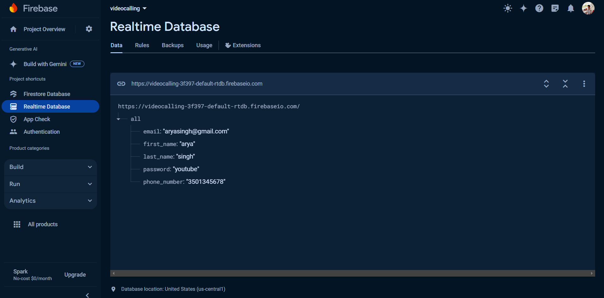
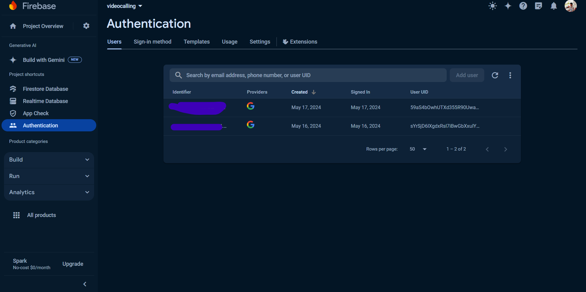

#  VideoCall App

Welcome to the VideoCall App by **ResoluteAI**! This application is designed to provide seamless and high-quality video calling experiences for individuals and businesses.

## Features

- **High-Quality Video and Audio**: Enjoy crystal clear video and audio during your calls.
- **Screen Sharing**: Share your screen with other participants easily.
- **Chat Functionality**: Text chat with participants during the call.
- **Cross-Platform Support**: Available on both desktop and mobile devices.
- **Secure and Private**: All calls are encrypted to ensure your privacy and security.

### ACTIVE - LOGIN SYSTEMS WEBRTC CREATED NOT INTEGRATED

## Demo Videos

Check out our demo videos to see the VideoCall App in action:

### Demo 1


### Demo 2


## Backend Screenshots

Here are some screenshots of the backend:

### RealtimeDB


### Oauth2


## Installation

To get started with the VideoCall App, follow these steps:

### Prerequisites

- Flutter SDK: [Install Flutter](https://flutter.dev/docs/get-started/install)
- Dart SDK: Included with Flutter
- IDE: VSCode, Android Studio, or any other preferred IDE

### Steps

1. **Clone the repository:**
   ```bash
   git clone https://github.com/ResoluteAI/videocall.git

2. **Navigate to the project directory:**
   ```bash
    cd videocall

3. **Get the necessary dependencies:**
    ```bash
    flutter pub get

4. **Run the application:**
    ```bash
    flutter run

### Usage

Once the application is running, you can:

Create a new video call by clicking the "New Call" button.
Join an existing call using the unique call ID.
Use the chat feature to send messages during a call.
Share your screen by clicking the "Share Screen" button.

### Contributing
We welcome contributions from the community! To contribute, please fork the repository and create a pull request with your changes. Make sure to follow our code of conduct.

### License
This project is licensed under the MIT License. See the LICENSE file for details.

### Contact
For any questions or support, please contact us at yettoannounce@gmail.com.

Thank you for using the VideoCall App! We hope you have a great experience.
